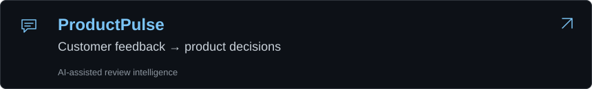
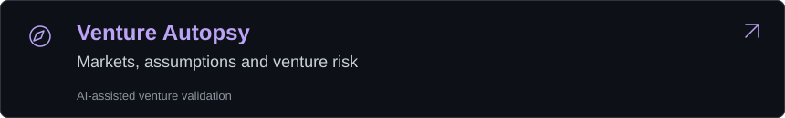

<h3 align="center"><code>balram@github ~ $ ./contributions.sh</code></h3>

<picture>
  <source media="(max-width: 900px)" srcset="./assets/contribution-graph-mobile.svg">
  
</picture>

 

<h3 align="center"><code>balram@github ~ $ whoami</code></h3>

<picture>
  <source media="(max-width: 900px)" srcset="./assets/identity-print-mobile.svg">
  
</picture>

 

<picture>
  <source media="(max-width: 900px)" srcset="./assets/snapshot-mobile.svg?v=language-spacing-2">
  
</picture>

 

<picture>
  <source media="(max-width: 900px)" srcset="./assets/selected-work-heading-mobile.svg">
  
</picture>

<a href="https://product-pulse-xi.vercel.app">
  <picture>
    <source media="(max-width: 900px)" srcset="./assets/featured-product-pulse-mobile.svg">
    
  </picture>
</a>

<a href="https://product-pulse-xi.vercel.app">Live demo ↗</a> &nbsp; · &nbsp; <a href="https://github.com/Balrammmm/product-pulse">GitHub source ↗</a>

<a href="https://venture-autopsy-eight.vercel.app">
  <picture>
    <source media="(max-width: 900px)" srcset="./assets/featured-venture-autopsy-mobile.svg">
    
  </picture>
</a>

<a href="https://venture-autopsy-eight.vercel.app">Live demo ↗</a> &nbsp; · &nbsp; <a href="https://github.com/Balrammmm/Venture-Autopsy">GitHub source ↗</a>

 

   &nbsp;
   &nbsp;
  

