<h3 align="center"><code>balram@github ~ $ ./contributions.sh</code></h3>

<picture>
  <source media="(max-width: 600px)" srcset="./assets/contribution-graph-mobile.svg">
  
</picture>

 

<h3 align="center"><code>balram@github ~ $ whoami</code></h3>

<picture>
  <source media="(max-width: 600px)" srcset="./assets/identity-print-mobile.svg">
  
</picture>

 

<picture>
  <source media="(max-width: 600px)" srcset="./assets/snapshot-mobile.svg">
  
</picture>

 

| Project | What it explores | Open |
| :--- | :--- | :--- |
|  **ProductPulse** | Customer feedback → product decisions | [Demo](https://product-pulse-xi.vercel.app) · [Source](https://github.com/Balrammmm/product-pulse) |
|  **Venture Autopsy** | Markets, assumptions and venture risk | [Demo](https://venture-autopsy-eight.vercel.app) |
|  **RetailPulse** | Retail data, business KPIs and insight | [Details](https://balram-portfolio-two.vercel.app) |
|  **NEO** | Audio, sensing and physical interaction | [Details](https://balram-portfolio-two.vercel.app) |
|  **ESP32 Quadcopter** | Motion sensing and motor control | [Details](https://balram-portfolio-two.vercel.app) |

 

   &nbsp;
   &nbsp;
  

