<picture>
  <source media="(prefers-color-scheme: light)" srcset="./assets/header-light.svg">
  
</picture>

  <a href="https://balram-portfolio-two.vercel.app"><strong>Portfolio</strong></a> &nbsp;·&nbsp;
  <a href="https://www.linkedin.com/in/balram-maurya-639026273">LinkedIn</a> &nbsp;·&nbsp;
  <a href="mailto:balrammaurya2005@gmail.com">Email</a>

I’m **Balram Maurya**, an Electronics & Communication Engineering student at **Thapar Institute**, based in Patiala, India. I build AI products, work with data, and explore embedded systems—from customer intelligence tools to physical prototypes.

### `balram@github ~ $ whoami`

<table>
  <tr>
    <td width="42%" valign="top">
      <picture>
        <source media="(prefers-color-scheme: light)" srcset="./assets/portrait-light.svg">
        
      </picture>
    </td>
    <td width="58%" valign="top">
      <picture>
        <source media="(prefers-color-scheme: light)" srcset="./assets/identity-light.svg">
        
      </picture>
    </td>
  </tr>
</table>

### `balram@github ~ $ ls ./selected-work`

**[ProductPulse](https://product-pulse-xi.vercel.app)** — Customer-review intelligence for product decisions. Turns review CSVs into sentiment, pain points, feature requests and roadmap recommendations.  
Next.js · TypeScript · React · AI analysis  
[Live demo](https://product-pulse-xi.vercel.app) · [Source](https://github.com/Balrammmm/product-pulse)

**[Venture Autopsy](https://venture-autopsy-eight.vercel.app)** — A venture-validation tool for examining an idea through its market, customer, business model, risks and evidence.  
[Live demo](https://venture-autopsy-eight.vercel.app)

**RetailPulse** — Retail analytics built around a star schema, business KPIs and 56K+ order-line records.  
**NEO** — A four-wheel ESP32 prototype with OLED expression output, microphone input, audio feedback and motor control.  
**ESP32 Quadcopter** — An engineering experiment in motion sensing, motor response and control with an MPU6050.  
[Explore the projects in my portfolio](https://balram-portfolio-two.vercel.app)

### `balram@github ~ $ cat ./interests`

**Software** — Next.js, React, TypeScript and Python.  
**Data** — Customer intelligence, analytics and translating evidence into product decisions.  
**Hardware** — ESP32, sensors, audio interfaces and physical prototypes.  
**Beyond the build** — Writing, entrepreneurship and understanding how systems behave.

### `balram@github ~ $ activity --last-year`

<picture>
  <source media="(prefers-color-scheme: light)" srcset="./assets/contributions-light.svg">
  
</picture>

  <a href="https://balram-portfolio-two.vercel.app/resume/business.pdf">Business / Product résumé</a> &nbsp;·&nbsp;
  <a href="https://balram-portfolio-two.vercel.app/resume/hardware.pdf">Hardware / Engineering résumé</a>

Same curiosity. Different angles.

