<code>balram@github ~ $ ./build --across-disciplines</code>

<h3 align="center">BALRAM MAURYA</h3>

<strong>AI · DATA · HARDWARE</strong> ECE @ Thapar · 2027

Learning by building across disciplines.

 

### `balram@github ~ $ ./activity --last-year`

<picture>
  <source media="(max-width: 600px)" srcset="./assets/contribution-graph-mobile.svg">
  
</picture>

 

### `balram@github ~ $ whoami`

<picture>
  <source media="(max-width: 600px)" srcset="./assets/whoami-mobile.svg">
  
</picture>

 

### `balram@github ~ $ ls ./selected-work`

**ProductPulse** — Customer-review intelligence that turns raw feedback into product decisions.  
[Demo](https://product-pulse-xi.vercel.app) · [Source](https://github.com/Balrammmm/product-pulse)

**Venture Autopsy** — AI-assisted venture validation for markets, assumptions, business models and risk.  
[Demo](https://venture-autopsy-eight.vercel.app)

**RetailPulse** — Retail analytics built around business KPIs and structured data.  
[Portfolio](https://balram-portfolio-two.vercel.app)

**NEO** — An ESP32 hardware prototype exploring display, audio, input and physical interaction.  
[Portfolio](https://balram-portfolio-two.vercel.app)

**ESP32 Quadcopter** — A control experiment connecting motion sensing, motor response and electronics.  
[Portfolio](https://balram-portfolio-two.vercel.app)

 

### `balram@github ~ $ cat ./interests`

**AI** → useful intelligence, automation, products  
**Data** → decisions inside messy information  
**Hardware** → sensors, machines, physical experiments  
**Markets** → finance, behavior, business systems

 

  <a href="https://balram-portfolio-two.vercel.app">Portfolio</a> &nbsp;·&nbsp;
  <a href="https://www.linkedin.com/in/balram-maurya-639026273">LinkedIn</a> &nbsp;·&nbsp;
  <a href="https://balram-portfolio-two.vercel.app/resume/business.pdf">Résumé</a>

